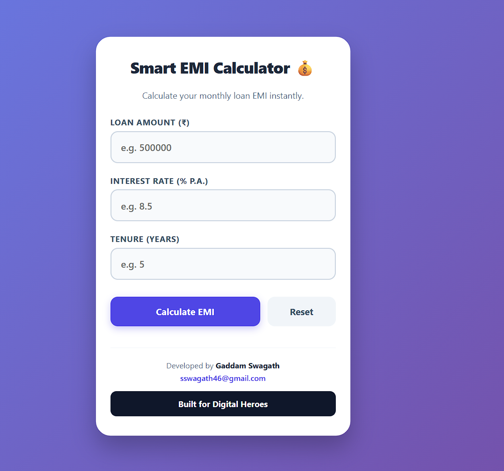

# 💰 Smart EMI Calculator

A simple, responsive, and user-friendly EMI Calculator built using **React.js** and **Vite**.

## 🚀 Live Demo

🔗 https://emi-calculator-by-swagath.vercel.app/

---

## 📌 Features

- ✅ Calculate Monthly EMI
- ✅ Calculate Total Interest
- ✅ Calculate Total Payment
- ✅ Instant Results
- ✅ Input Validation
- ✅ Reset Functionality
- ✅ Responsive Design
- ✅ Mobile & Desktop Friendly

---

## 🛠️ Technologies Used

- React.js
- JavaScript (ES6+)
- CSS3
- Vite

---

## 📷 Preview

---

## 👨‍💻 Developed By

**Gaddam Swagath**

📧 Email: sswagath46@gmail.com

🌐 Portfolio: https://portfolio-olive-one-e9wfg0chro.vercel.app/

💻 GitHub: https://github.com/swagath088

🔗 LinkedIn: https://www.linkedin.com/in/gaddam-swagath/

---

## 📂 Repository

https://github.com/swagath088/emi-calculator-by-swagath

---

## ⭐ Special Requirement

Built for Digital Heroes

https://digitalheroesco.com
